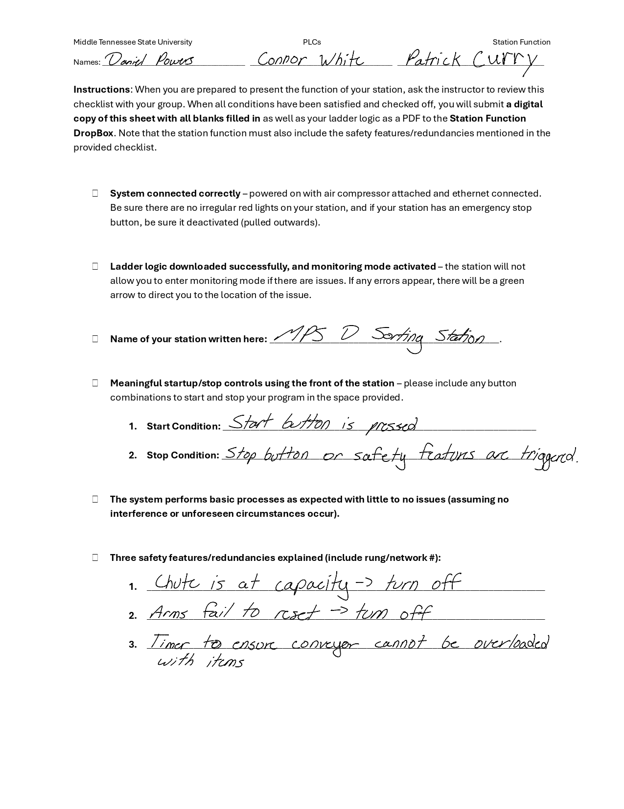

# Daniel Powers – Portfolio

Hi, I’m Daniel Powers, a Computer Science undergraduate at Middle Tennessee State University (MTSU). I will graduate in Summer 2025 with minors in Engineering Technology and Audio Production.

What began as a love for software and problem-solving evolved into a passion for intelligent hardware-software systems. Through hands-on experience with platforms like Arduino and Siemens PLCs, I discovered how rewarding it is to build embedded systems that respond to the real world — systems that don’t just compute, but interact. That realization drove me to accelerate graduation and pursue embedded computing with clarity and urgency.

I’m preparing to begin an M.S. in Computer Engineering at the University of Tennessee, Knoxville (UTK). I aim to contribute to sustainable, human-centered technologies — from intelligent robotics to assistive devices. This portfolio showcases the work that shaped that path: from low-level motor control to lighting system diagnostics, from practical logic design to research-driven circuit optimization.

---

## Project Index

### Embedded Systems & Engineering Projects
- [LED Driver Optimization for Agricultural Systems](#led-driver-optimization-for-agricultural-systems)
- [Autonomous Line-Following Robot](#autonomous-line-following-robot)
- [PLC Conveyor System with Part Classification](#plc-conveyor-system-with-part-classification)

### Computer Science & Software Projects
- [Mooflixz: Full-Stack Music Web App](#mooflixz-full-stack-music-web-app-nodejs-reactjs-and-mysql)
- [MTSU Study App (Node.js & React.js)](#mtsu-study-app-nodejs--reactjs)
- [Student Parking App (JavaFX)](#student-parking-app-javafx)

### Additional Information
- [Leadership & Involvement](#leadership--involvement)
- [Resume & CV](#resume--cv)
- [Contact](#contact)

## Featured Projects

### LED Driver Optimization for Agricultural Systems  
**Role:** Undergraduate Researcher, Smart Sensing and Robotics Lab  

<table align="center">
  <tr>
    <td align="left">
      <br/>
      <sub>MTSU LED lighting Cart Towing Test</sub>
    </td>
    <td align="left">
      <br/>
      <sub>Custom drawn wiring schematic for LED panel</sub>
    </td>
    <td align="left">
      <br/>
      <sub>Illuminated MTSU lighting system during night testing</sub>
    </td>
  </tr>
</table>


**LED Driver Cart**
- Designed and tested an active cooling system that **reduced LED array temperatures by over 50%**.
- Identified and resolved electrical faults, including surge current events, incorrect fuse ratings, and driver instability.
- Acquired practical experience in power electronics, thermal characterization, and hardware-level debugging.
- Created a modular schematic for a portable, multi-panel LED array with independent power channels.
- Documented research procedures, design revisions, and test results for lab continuity.

**241 Robot**
> Autonomous towing platform used to mobilize the LED Driver Cart during field testing.
- Sole maintainer and point of contact for a legacy autonomous robot system with a Python-based control codebase.
- Responsible for operating the robot during research trials and maintaining functional readiness across test cycles.
- Coordinated synchronized testing between the 241 Robot and the LED Driver Cart, ensuring consistent deployment conditions.
- Support lab members by providing system knowledge, troubleshooting expertise, and hands-on operational guidance.

> [Browse Full Research Archive on Google Drive](https://drive.google.com/drive/folders/1V1oGmuduu4vE4Lxfo83EEtWq45R1BIOt?usp=sharing)

---

### Autonomous Line-Following Robot

<table align="center">
  <tr>
    <td align="left">
      <br/>
      <sub>Line-following Robot: Line-following demo</sub>
    </td>
    <td align="left">
      <br/>
      <sub>Boolean Based Line-following Approach</sub>
    </td>
    <td>
      <br/>
      <sub>Line-Following Robot: Climbing Test</sub>  
    </td>
    </tr>
</table>

```cpp
// Basic snippet from line-following robot
void move(int direction, int speed){
  int leftSpeed = 0;
  int rightSpeed = 0;

  if (direction == 1) { // Right
    leftSpeed = -1 * speed;
    rightSpeed = speed;
  } else if (direction == 2) { // Left
    leftSpeed = speed;
    rightSpeed = -1 * speed;
  } else if (direction == 3) { // Forwards
    leftSpeed = speed;
    rightSpeed = speed;
  } else if (direction == 4) { // Backwards
    leftSpeed = -1 * speed;
    rightSpeed = -1 * speed;
  }

  // Motor Drift Correction
  Encoder_1.setTarPWM(leftSpeed);
  Encoder_2.setTarPWM(rightSpeed * 1.20);
}
```

- Developed a **sensor-driven navigation algorithm** on Arduino IDE using **IR reflectance sensors**.
- Implemented **motor calibration** and **sensor edge detection error correction**.
- Built and tested on a **Makeblock Ultimate Kit** platform.
- Experimented with logic for **junction loss**, **sharp turns**, and **intersection control**.

> [View Arduino Code (LineFollower.ino)](RoboticsMedia/ArduinoCode/LineFollower.ino)

---

### PLC Conveyor System with Part Classification 

<table align="center">
  <tr>
    <td align="left">
      <br/>
      <sub>Worksheet with Safety Considerations</sub>
    </td>
    <td align="left">
      <br/>
      <sub>Image of Model Sorting System Programmed</sub>
    </td>
    <td align="left">
      <br/>
      <sub>Image 1 of Ladder Logic</sub>
    </td>
  </tr>
</table>

- Modeled an industrial sorting system using **Siemens S7-1500 PLC** and **TIA Portal**.
- Integrated color and metal detection sensors.
- Programmed safety features and classification logic with ladder diagrams.

> [View Full Sorting Ladder Logic (SortingLadder)](PLCMedia/SortingLadder.pdf)

---

### Mooflixz: Full-Stack Music Web App (Node.js, React.js, and MySQL)
- Developed using **React.js**, **Node.js**, **MySQL**, and **Azure OAuth**.
- Features Spotify/YouTube integration for music discovery and playlist creation.
- Designed the SQL schema, implemented user authentication, and built a responsive frontend.

> _GitHub link or screen recording can be embedded here._

---

### MTSU Study App (Node.js & React.js)
- Helped centralize CS study materials.
- Integrated Microsoft Azure authentication and co-designed frontend UI using React.

---

### Student Parking App (JavaFX)
- The JavaFX app will assist students in locating permitted campus lots based on their parking pass and class locations.
- Includes GUI design and input handling.

---

## Leadership & Involvement
**Vice President & Rank Leader**, Band of Blue Marching Band<br>
- Led rehearsals, mentored section leaders, and supported event logistics.

**Member**, Association for Computing Machinery (ACM)<br>
**True Blue Scholarship Recipient**, 8/8 Semesters<br>
**Dean's List**, Fall 2021 – Present

---

## Resume & CV

📥 [Download My Resume (PDF)](link-to-your-resume)


---
## Contact

📧 dkp3g@mtmail.mtsu.edu  
📧 keionnepowers@hotmail.com  
📱 (970) 590-9094 (Text Preferred)


